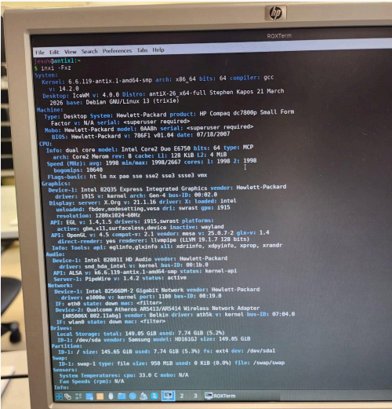
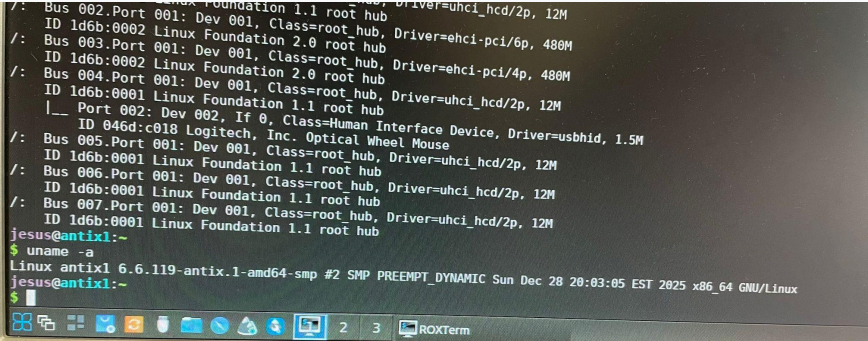
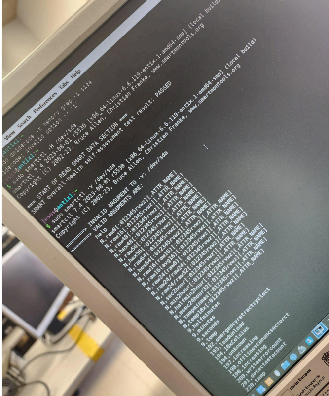
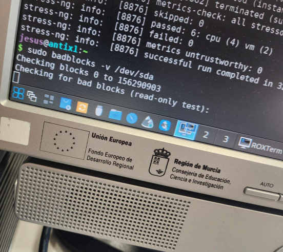
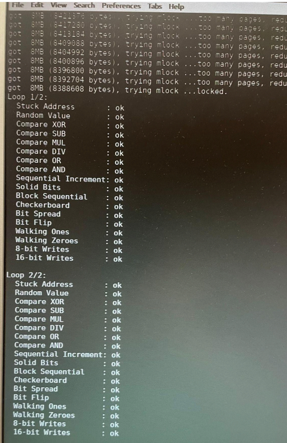
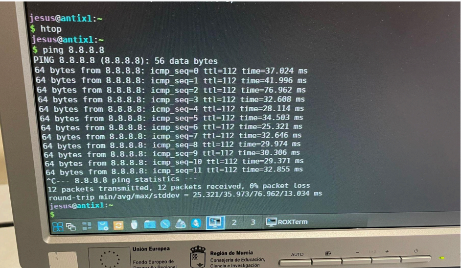
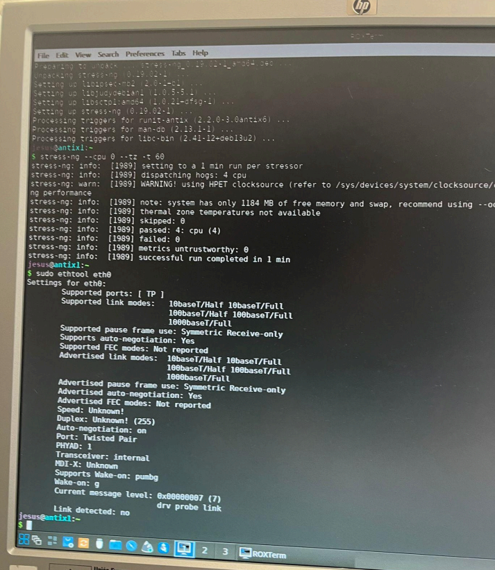
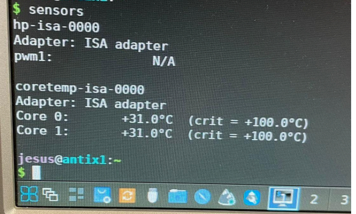
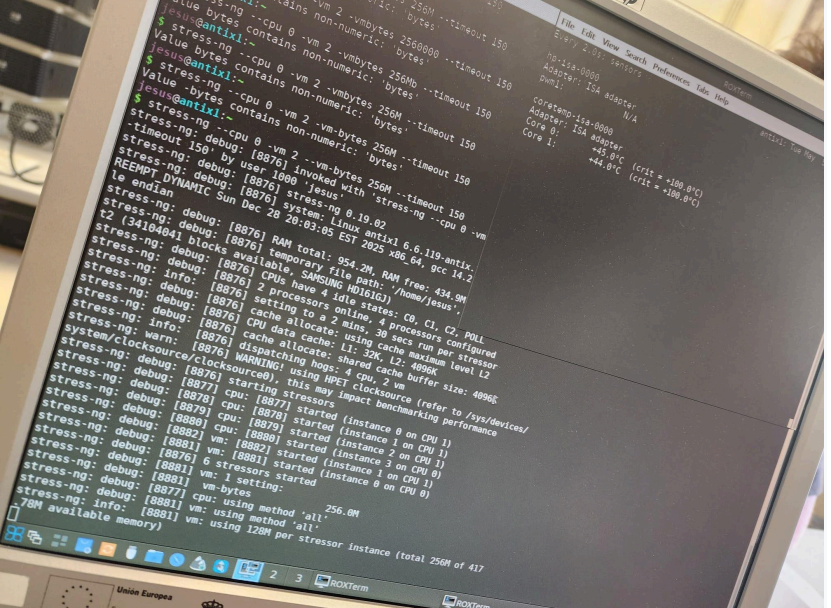
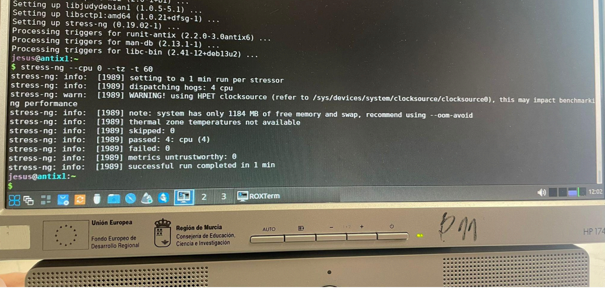

# Ejercicio 4. Diseño de una plantilla de informe técnico.

### Informe Ténico Realizado en el Taller:

Datos de Alumno: Alfonso Giménez Martínez

Fecha: 05/05/2026

### Identificación del equipo:

Marca: HP

Modelo: Compaq dc 7800p

Nº Serie: CZC7490LD3

### Capturas Hechas:

### Especificaciones del Hardware:

CPU: Intel Core 2 Duo E6750 @ 2.66GHz (Dual Core)
RAM: 1 GB DDR2 800 MHz
Disco: Samsung SpinPoint F1 DT (HD161GJ) de 160 GB
GPU: Intel 82Q35 Express Integrated Graphics Controller
Red: Ethernet Intel 82566DM-2 Gigabit / Wi-Fi Qualcomm Atheros AR5413/AR5414

### Capturas Hechas:

### Versión de linux Instalada

Distribución: antiX-26_x64-full

Versión: 26 (trixie)

Kernel: 6.6.119-antix.1-amd64-smp

### Capturas realizadas:

### Estado del disco duro (SMART / BADBLOCK)

SMART (resuktado general): PASSED

Sectores reasignados: 0

Errores detectados: Ninguno (NO Errors Logged)

Badlocks: Test de lectura iniciado sin errores reportados

### Capturas realizadas:

### Estado de la Memoria RAM

Memtest / memtester: Ejecutado memtester (512M)

Resultado: Superó 2 ciclos (Loop 2/2) sin errores ("ok") en todas las pruebas de
integridad

### Capturas Realizadas:

### Comprobación de red:

Ping (latencia y pérdida): Latencia media de 35.973 ms con 0% de pérdida de paquetes
(a 8.8.8.8)
Velocidad (iperf3): No se pudo completar (Fallo de resolución de red en apt update)
Estado red (ethtool): Link detected: no (Interfaz eth0 sin cable conectado)

### Capturas realizadas:

### Temperaturas y Estabilidad

Sensores (CPU temperatura): 31°C en reposo / 45°C bajo carga máxima
Prueba de estrés: Ejecutada con stress-ng (4 CPU, 2 VM) durante 60s
Resultado estabilidad: El sistema completó las pruebas de carga sin bloqueos ni
sobrecalentamiento

### Capturas realizadas:

### Incidencias Detectadas:

Falta de conectividad física: La interfaz Ethernet no detecta enlace y los repositorios no
sincronizan por falta de red configurada.
Errores de Hardware en dmesg: Fallos menores en la comunicación con el chip TPM y
el Intel Management Engine (mei_me).

### Conclusión Final: APTO

### Observaciones Finales

El equipo es funcional y térmicamente estable, el disco duro y la memoria RAM están
en perfectas condiciones físicas, recomiendo revisar el cableado de red y actualizar
el firmware de la BIOS para intentar resolver los errores de comunicación con el
módulo TPM detectados en el kernel.
